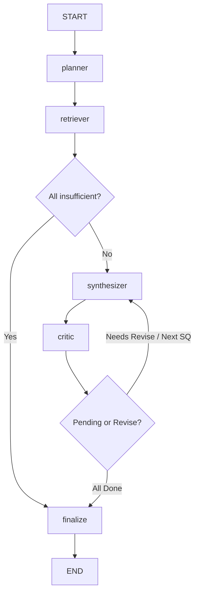

# InsightForge AI

A retrieval-augmented research system with local embeddings, multi-source ingestion, and pgvector-backed semantic search.

## Status

- **Phase 1** — Environment & Skeleton: ✅ complete
- **Phase 2** — PostgreSQL + pgvector schema: ✅ complete
- **Phase 3** — Data ingestion pipeline: ✅ complete
- **Phase 4** — LLM connectivity: ✅ complete
- **Phase 5** — MCP tool servers: ✅ complete
- **Phase 6** — Build agents individually: ✅ complete (select-and-assemble grounding & verified local LLM evaluation)
- **Phase 7** — Wire agents into LangGraph: ✅ complete (state machine, sequential routing, run tracking, sufficiency gating)

## Architecture

| Layer | Technology |
|---|---|
| Ingestion sources | Wikipedia, RSS, ArXiv PDFs |
| Embedding | `BAAI/bge-small-en-v1.5` (local, 384-dim, no API calls) |
| Storage | PostgreSQL 16 + pgvector |
| Vector index | HNSW with cosine distance |
| LLM Provider | Configurable via `LLM_PROVIDER` in `.env` (Ollama local or OpenAI) |
| Local Model | `llama3.1-8k` (custom Ollama Modelfile with 8192 context window) |
| Tools | web_search (Tavily API), calculator (simpleeval), db_lookup (pgvector similarity search) |
| Agent Orchestration | LangGraph (`StateGraph` with conditional edges & sequential loops) |
| API | FastAPI + Uvicorn |
| Container | Docker Compose (migrate / api / db services) |

## Phase 7: LangGraph Workflow & Orchestration

The research workflow is implemented as a state machine in `app/agents/graph/graph.py` with pure routing functions in `app/agents/graph/routing.py`:



### Key Workflow Mechanisms

1. **State Machine (`ResearchState`)**:
   Nodes take state dicts and return state diffs, completely replacing `MemoryStore` on the graph path. Contains `run_id`, `topic`, `sub_questions`, `evidence`, `sections`, `max_revisions`, `final_status`, and `critique_history`.
2. **Evidence Sufficiency Rule**:
   Computed purely in deterministic code by `retriever_node` (not via the LLM). Requires:
   - At least 3 retrieved chunks under cosine distance cutoff `0.255` (calibrated against `BAAI/bge-small-en-v1.5`).
   - At least 2 candidate sentences remaining after filtering.
   - Non-stopword query keyword overlap against retrieved chunk content.
   If ALL sub-questions lack sufficient evidence, the graph terminates early with `final_status="insufficient_evidence"` and skips the Synthesizer.
3. **Sequential Execution**:
   To prevent concurrency lockups on local CPU-based Ollama instances, all sub-questions and agent passes run strictly sequentially (one LLM call at a time).
4. **Revision Cap & Section Gating**:
   Configurable `max_revisions` (default 1). If a section fails the Critic check and reaches `max_revisions`, the latest draft is retained, the section is marked `unverified`, and the graph continues to the next sub-question. `final_status` is computed as `partial` (never `approved`) when unverified sections are present.
5. **Database Run Tracking**:
   The workflow logs lifecycle records to `research_runs` (start, finish, final status), `agent_steps` (step index, execution timing, input/output summaries), and `revisions` (cycle number and Critic rejection reasons). Tracking failures log warnings and do not crash the run.

### Running the Graph

Execute a research run from inside the API container:
```bash
docker compose exec api python -m app.agents.graph.run_graph "the environmental and economic impact of AI"
```

## Phase 6: Select-and-Assemble Agent Grounding

Drafts produced by the Synthesizer are strictly **cited extracts, not free-form prose**. The synthesizer parses evidence chunks into candidate sentences, removes fragments, headings, affiliation lines, and reference lists, pairs dangling referents ("This/It") with their immediate antecedent, caps candidates to 25, and prompts the LLM to return only sentence IDs. Code assembles the verbatim sentences with explicit citations.

The CriticAgent conducts:
1. **Deterministic code-level substring verification**: Checks each extracted sentence directly against normalized retrieved chunks to guarantee 100% evidentiary grounding without regex distortion.
2. **LLM completeness & on-topic check**: Evaluates whether the draft directly addresses the core sub-question, requesting JSON mode (`{"answers": bool, "missing": str | null}`). Unparseable critic outputs strictly default to `revise`.

## Known Limits & Remaining Weaknesses

1. **Cited Extracts vs. Prose**: Drafts consist of concatenated verbatim extracts. While this avoids factual hallucination by construction, the drafts lack narrative connective phrasing and stylistic transitions.
2. **Critic Scope**: The Critic evaluates topical completeness and verifies literal chunk presence; it does not perform granular sentence-by-sentence relevance scoring or inter-sentence redundancy removal.
3. **Sentence Candidate Relevance**: After author/affiliation and header filtering, candidate sentences in the corpus measure at **43.3% strictly relevant, 26.7% marginal, and 30.0% irrelevant**. The Synthesizer's sentence ID selection must actively filter out the remaining marginal candidates.
4. **Embedding Distance Sensitivity**: The distance cutoff ($0.255$) depends on `BAAI/bge-small-en-v1.5` cosine geometry. While it blocks out-of-scope topics with 100% accuracy in our tests, niche in-domain sub-questions can be falsely blocked if phrasing diverges from the chunk vocabulary.
5. **Relevance Floor vs. Critic Overlap**: The Synthesizer applies a strict 0.50 sentence-level semantic relevance floor against the sub-question. This aggressively filters out overtly off-topic or pure-background sentences before they reach the LLM draft. Consequently, the Critic's "revise" loops are primarily triggered by *incomplete coverage* (e.g. omitting a required aspect of a multi-part question) rather than by entirely irrelevant content.
6. **Stale Critic Benchmark Fixtures**: The Critic benchmark suite (`test_critic_suite.py`) fixtures were authored prior to the introduction of the 0.50 sentence-level relevance floor in the Critic. Because the sentences in the 8 "good" benchmark fixtures score below 0.50 similarity against their specific sub-questions, they are flagged as insufficient relevance in the benchmark summary (0/8 approved). This is a known fixture staleness limitation, not an agent regression.

## Local LLM Setup (Ollama)

1. **Pull the base model**:
   ```bash
   ollama pull llama3.1:8b
   ```
2. **Build the 8k context model**:
   ```bash
   cd ollama
   ollama create llama3.1-8k -f Modelfile
   ```
3. **Model Keep-Alive (`OLLAMA_KEEP_ALIVE`)**:
   By default, Ollama unloads inactive models after 5 minutes, resulting in ~10s cold-start model load times. To keep weights resident in memory, set:
   ```powershell
   # Windows PowerShell
   $env:OLLAMA_KEEP_ALIVE="30m"; ollama serve
   ```
   ```bash
   # Linux / macOS
   export OLLAMA_KEEP_ALIVE="30m"
   ```
4. **Execution & CPU Latency**:
   Local LLM inference runs sequentially on host CPU. Warm calls execute in ~0.5s for small queries and ~4–6s for synthesis prompts, compared to ~10–15s for cold start. A `warm_up_llm()` helper in `app.core.llm.client` primes the model at system startup.

## Quick Start

```bash
cp .env.example .env          # fill in POSTGRES_* values
docker compose up -d          # runs migrate, then api, then db
docker compose ps             # all services should be healthy

# Populate the knowledge base
docker compose exec api python -m app.ingestion.run_ingestion

# Verify search
docker compose exec api python -m app.ingestion.verify_search
```

## Database migrations

Migrations run automatically via the `migrate` service on `docker compose up`.

To run manually:
```bash
docker compose exec api alembic upgrade head
docker compose exec api alembic current
```

Destructive migrations are guarded behind `ALLOW_DESTRUCTIVE_MIGRATIONS=1` in `.env`.

## Folder Structure

- `app/api` — FastAPI routes
- `app/agents` — Individual agents: Planner, Retriever, Synthesizer, Critic
- `app/agents/graph` — LangGraph implementation: state, nodes, routing, graph, run_graph, tracking
- `app/db` — SQLAlchemy models and session
- `app/ingestion` — Multi-source ingestion pipeline
- `app/mcp_servers` — MCP server implementations
- `app/core` — Configuration and LLM client
- `ollama` — Custom Modelfile and Ollama operational instructions
