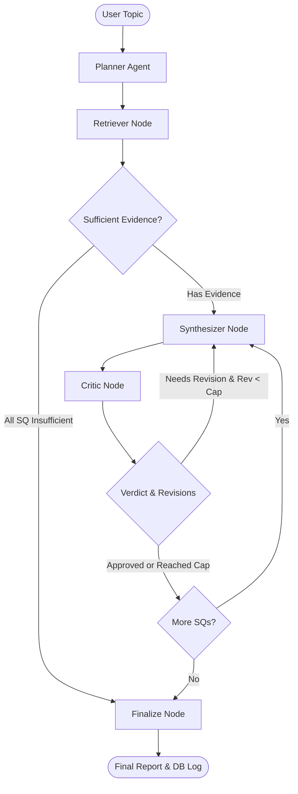

# InsightForge AI — Autonomous Research & Report Generation

A retrieval-augmented research assistant that autonomously investigates complex topics, gathers evidence from an embedded knowledge base, synthesizes citation-grounded drafts, and subjects every section to automated verification.

---

## 1. System Status & Implementation Phases

| Phase | Description | Status |
|:---:|:---|:---:|
| **Phase 1** | Project skeleton, dependencies, Docker & configuration | ✅ Complete |
| **Phase 2** | PostgreSQL 16 + pgvector schema, HNSW index & Alembic migrations | ✅ Complete |
| **Phase 3** | Ingestion pipeline (ArXiv PDFs, Wikipedia, RSS) & embedding (`bge-small-en-v1.5`) | ✅ Complete |
| **Phase 4** | Unified LLM abstraction (`call_llm`, fallback handling, Ollama integration) | ✅ Complete |
| **Phase 5** | Model Context Protocol (MCP) tool servers (db_lookup, web_search, calculator) | ✅ Complete |
| **Phase 6** | Agent implementations: Planner, Retriever, Synthesizer (extract-and-assemble), Critic | ✅ Complete |
| **Phase 7** | LangGraph orchestration (`ResearchState`, sequential loop, sufficiency gating, revision cap) | ✅ Complete |
| **Phase 8** | Database run tracking (`research_runs`, `agent_steps`, `tool_calls`, `revisions`) | ✅ Complete |
| **Phase 9** | FastAPI production interface (`POST /research`, `GET /research/{run_id}`) | ✅ Complete |
| **Phase 10** | Polish & Evaluation (empirical metrics, setup documentation, clean-restart test, test suite) | ✅ Complete |
| **Phase 11** | React + TypeScript + Vite production workstation (TanStack Query, Tailwind, responsive) | ✅ Complete |

---

## 2. Architecture & Data Flow



| Layer | Component | Details |
|:---|:---|:---|
| **API Entrypoint** | FastAPI (`uvicorn`) | Asynchronous non-blocking dispatch with SQLite/Postgres run tracking |
| **Orchestrator** | LangGraph (`StateGraph`) | Directed cyclic state machine with sequential CPU-safe execution |
| **Local LLM** | Ollama (`llama3.1-8k`) | Llama-3.1 8B with custom 8,192 token context window (`temperature: 0`) |
| **Embedding Engine** | `BAAI/bge-small-en-v1.5` | 384-dimensional dense vectors (local CPU execution, no external APIs) |
| **Vector Database** | PostgreSQL 16 + pgvector | Cosine distance index (`<=>`) with 0.255 calibrated sufficiency cutoff |
| **Knowledge Base** | Multi-source chunks | 970+ chunks from ArXiv research papers, Wikipedia articles, and RSS feeds |
| **Agent Gating** | Select-and-Assemble | Deterministic candidate filtering + verbatim sentence extraction + 0.50 relevance floor |
| **Run Observability** | PostgreSQL logging | Relational trace logs for runs, individual agent steps, MCP tool calls, and revision loops |

---

## 3. Cold Start Setup Guide

Follow these steps from a clean host environment to install prerequisites, build the local model, spin up services, ingest the knowledge base, and execute a live research request.

### 3.1 Prerequisites

1. **Docker Desktop**: Version 4.25+ (with Docker Compose v2.20+).
2. **Ollama**: Installed locally on the host machine ([ollama.com](https://ollama.com)).
3. **Host Networking / Firewall**: Docker must be able to reach host port `11434` via `host.docker.internal`.

### 3.2 Ollama Model Configuration

InsightForge requires an expanded 8,192-token context window so that multi-chunk evidence and candidate sentences can be processed without truncation.

1. **Pull the base model**:
   ```bash
   ollama pull llama3.1:8b
   ```

2. **Build the 8k context model**:
   Inspect the Modelfile in `ollama/Modelfile`:
   ```dockerfile
   FROM llama3.1:8b
   PARAMETER num_ctx 8192
   PARAMETER temperature 0
   ```
   Create the model:
   ```bash
   ollama create llama3.1-8k -f ollama/Modelfile
   ```

3. **Configure Model Resident Memory (Keep-Alive)**:
   By default, Ollama unloads inactive models after 5 minutes. To avoid repeated ~10–15s cold starts:
   - **Windows PowerShell**:
     ```powershell
     $env:OLLAMA_KEEP_ALIVE="30m"; ollama serve
     ```
   - **Linux / macOS**:
     ```bash
     export OLLAMA_KEEP_ALIVE="30m" && ollama serve
     ```

### 3.3 Environment Variables (`.env`)

Copy the template:
```bash
cp .env.example .env
```

| Variable | Description | Default / Requirement |
|:---|:---|:---|
| `APP_ENV` | Application environment mode (`development` or `production`) | `development` |
| `APP_PORT` | Host port mapped to FastAPI API container | `8000` |
| `POSTGRES_USER` | PostgreSQL superuser username | `insightforge` |
| `POSTGRES_PASSWORD` | PostgreSQL superuser password | `insightforge` |
| `POSTGRES_DB` | Target PostgreSQL database name | `insightforge` |
| `DATABASE_URL` | SQLAlchemy async/sync connection string | `postgresql://insightforge:insightforge@db:5432/insightforge` |
| `LLM_PROVIDER` | Active LLM driver (`ollama` or `openai`) | `ollama` (works locally without API keys) |
| `OLLAMA_BASE_URL` | Ollama OpenAI-compatible endpoint inside Docker | `http://host.docker.internal:11434/v1` |
| `OLLAMA_MODEL` | Target Ollama model name | `llama3.1-8k` |
| `OPENAI_API_KEY` | Fallback API key if `LLM_PROVIDER=openai` | Placeholder works for Ollama |
| `TAVILY_API_KEY` | API key for external web search MCP server | Optional placeholder; needed only for external search |

### 3.4 Cold-Start Execution Commands

Execute this sequence in order:

```bash
# 1. Build and launch database and API containers
docker compose up -d --build

# 2. Confirm all services are healthy (api, db, migrate)
docker compose ps

# 3. Populate the pgvector knowledge base (ArXiv, Wikipedia, RSS)
docker compose exec api python -m app.ingestion.run_ingestion
# Note: Ingestion draws from live dynamic feeds (ArXiv, Wikipedia, RSS).
# Total chunk counts may vary slightly across runs (e.g., 972 vs. 988 chunks); this is expected real-world behavior.

# 4. Verify vector similarity search is operational
docker compose exec api python -m app.ingestion.verify_search

# 5. Check API health endpoint
curl http://localhost:8000/health
```

### 3.5 Submitting a Research Request

Submit a research request to the Phase 9 API:

```bash
curl -X POST http://localhost:8000/research \
  -H "Content-Type: application/json" \
  -d '{"topic": "the environmental impact of AI computing hardware and energy consumption"}'
```

Response:
```json
{"run_id": 1, "status": "running"}
```

Poll the status and retrieve the structured report:
```bash
curl http://localhost:8000/research/1
```

Once complete, the endpoint returns the report breakdown, per-section citations, and status (`approved`, `partial`, or `insufficient_evidence`).
 
### 3.6 Starting the Frontend Web Application

InsightForge includes a production-ready React + TypeScript + Vite research workstation located in `frontend/`.

```bash
# 1. Navigate to the frontend directory
cd frontend

# 2. Install dependencies
npm install

# 3. Launch the development server
npm run dev
```

The application will be accessible at `http://localhost:5173/`. In development mode, Vite automatically proxies API requests (`/research`, `/health`) to `http://localhost:8000`.

To run frontend automated tests:
```bash
npm test
```

---

## 4. Troubleshooting & Operational Gotchas

| Issue | Root Cause | Solution |
|:---|:---|:---|
| **Container cannot reach Ollama** (`Connection refused`) | Docker container cannot resolve or connect to host loopback `127.0.0.1` | Ensure `OLLAMA_BASE_URL=http://host.docker.internal:11434/v1` is configured and `extra_hosts: ["host.docker.internal:host-gateway"]` is present in `docker-compose.yml`. Verify Ollama is actively serving on host. |
| **Stale container code after edits** | Docker Compose cached the image layer and did not detect host file changes | Run `docker compose up -d --build` to force an image rebuild with the latest code. |
| **First-call latency (~10–15s)** | Normal cold start: PyTorch/HuggingFace loading `bge-small-en-v1.5` weights and Ollama loading `llama3.1-8k` into host RAM | Do not kill the process. Subsequent warm queries execute in ~500ms to 4s. Set `OLLAMA_KEEP_ALIVE="30m"`. |
| **Slow run vs. genuinely stuck run** | CPU inference takes ~25–45s per LLM generation. A full 3-question run takes 2–4 minutes | Poll `GET /research/{run_id}`. If `steps_completed` increments every ~30–60s, execution is healthy. If no log entries appear for >300s, check host CPU throttling or container memory limits. |

---

## 5. Automated Test Suite

To verify the integrity of all agents, routing logic, retrieval constraints, revision loops, and end-to-end execution, run the consolidated test suite:

```bash
# Inside the container:
docker compose exec api python run_suite.py

# Or directly via pytest:
docker compose exec api pytest -v \
  app/agents/tests/test_routing.py \
  app/agents/tests/test_retrieval_quality.py \
  app/agents/tests/test_phase6.py \
  app/agents/tests/test_retriever_ood.py \
  app/agents/tests/test_revision_cap.py \
  app/agents/tests/test_forced_revision.py \
  app/agents/tests/test_critic_suite.py \
  app/agents/tests/test_end_to_end_smoke.py
```

> **Runtime Notice:** The full automated suite makes real live LLM and embedding calls (no mocks) and executes in approximately **15 to 25 minutes** on CPU.

---

## 6. Phase 10 Evaluation & Measured Metrics

Evaluation metrics were computed across 15 fresh, unforced runs (IDs 5–19) on the fixed research graph using `app/evaluation/compute_metrics.py`. See [METRICS.md](file:///c:/Users/Avadhut%20Jadhav/OneDrive/Desktop/InsightForge/METRICS.md) for full data tables and analysis.

- **Status Distribution:** 13.3% Approved, 46.7% Partial, 40.0% Insufficient Evidence (100% of out-of-domain topics blocked at retrieval).
- **Critic Approval Rate:** **94.4%** across sections evaluated by the Critic (17 approved / 18 evaluated); **63.0%** across all 27 planned sub-questions in synthesis runs (15 approved without revision, 2 approved after revision, 1 unverified at cap, 9 insufficient evidence at floor, **0 synthesized unevaluated**). Category sum: 15 + 2 + 1 + 9 = 27 (100.0%).
- **Revision Cost:** Runs with revision cycles averaged **147.23s** versus **44.77s** for zero-revision runs (+102.46s latency overhead).
- **Retrieval Threshold Margin:** Approved queries had a mean minimum distance of **0.2138** (below 0.255 threshold); rejected out-of-domain queries averaged **0.3437** (clean ~0.09 margin).

> **Ground Truth Disclaimer:** The Critic's approval verdict represents internal consistency (verbatim chunk match + LLM question completeness check) and does NOT constitute external factual ground truth.

> **Evaluation Data Reproduction:** Historical evaluation run data can be re-generated at any time by re-running the 15-topic batch described in this section against the live system (`python -m app.evaluation.compute_metrics --run-ids <ids>`), rather than relying on a committed data snapshot or database dump.

---

## 7. Known Limitations (Consolidated)

The following known limitations and architectural trade-offs have been identified:

1. **Cross-Section Content Overlap on Narrow Evidence**:
   When the knowledge base contains narrow evidence on a broad topic, the independent per-sub-question synthesizer passes can select identical or near-duplicate high-ranking sentences across different sections. For example, in Run 30, Sections 1, 2, and 3 all cited the same sentence regarding AI hardware resource consumption. The current state machine does not perform cross-section deduplication.
2. **Relevance Floor vs. Critic Overlap**:
   The Synthesizer applies a strict 0.50 sentence-level cosine relevance floor against the sub-question. This aggressively prunes off-topic sentences before drafting. Consequently, the Critic's "revise" loop is almost exclusively triggered by *incomplete coverage* (omitting an aspect of a multi-part question) or when fewer than 2 sentences survive the floor, rather than by overtly fabricated statements.
3. **Stale Critic Benchmark Fixtures**:
   The test fixtures in `test_critic_suite.py` were written before the 0.50 sentence-level relevance floor was introduced. Several older fixture sentences score below 0.50 against their sub-questions, causing them to be flagged as insufficient relevance in the benchmark summary. This is a known fixture staleness artifact, not an agent regression.
4. **No Tool-Augmented Retrieval in Live Graph**:
   While MCP tool servers for web search (Tavily), calculator, and DB lookup are fully implemented, the live LangGraph `retriever_node` queries pgvector directly and does not dispatch dynamic web searches during execution.
5. **Calibrated Threshold Corpus Specificity**:
   The distance cutoff ($0.255$) and sentence relevance floor ($0.50$) were calibrated empirically against `BAAI/bge-small-en-v1.5` over a ~970-chunk corpus. While effective at blocking out-of-domain topics, the thresholds can reject niche in-domain queries if phrasing diverges from chunk vocabulary (e.g. Run 45).
6. **No API Authentication or Distributed Rate-Limiting**:
   The Phase 9 FastAPI endpoint does not implement API key authentication or user rate-limiting. A global in-memory lock (`asyncio.Lock`) serializes execution inside the container to protect local CPU resources; high-throughput deployments require an external queue (Celery/Redis).
7. **CPU-Only Local Inference Latency**:
   On CPU hardware, each LLM generation takes 15–40 seconds. A full 3-question research run with one revision cycle requires 2–4 minutes. Dedicated GPU acceleration would reduce this latency by 5–10x.
8. **Asymmetric State-Matching Routing Gap (Resolved)**:
   In earlier iterations prior to October 2026, an asymmetric state-matching defect existed between `critic_node`'s candidate scanning loop and `get_next_sub_question_to_process` in `routing.py`. If an earlier sub-question had an `insufficient_evidence` verdict while a later sub-question had already been drafted (`status = "synthesized"`), `critic_node` prioritized the earlier section for critique/revision. Once that earlier section settled, `get_next_sub_question_to_process` only queried for `needs_revision` or `pending` sections. Because the drafted section was in intermediate state `synthesized`, the function returned `None` and routed directly to `finalize`, leaving ~14.8% (4 of 27) of sections drafted but uncritiqued in the initial evaluation batch (runs 40–54). This bug was diagnosed, root-caused, and resolved in October 2026 by:
   - Updating `get_next_sub_question_to_process` to explicitly queue `synthesized` sections for critique ahead of `pending` items.
   - Updating `synthesizer_node` to pass already-drafted `synthesized` sections directly to `critic_node` without redundant LLM re-generation.
   - Updating `critic_node` to prioritize `synthesized` sections ahead of `insufficient_evidence` items.

